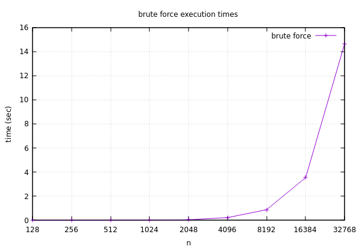

# parallel-closest-pair
The closest pair problem solved with a divide-and-conquer approach leveraging parallelism.

## The Problem
"The **closest pair of points problem** or **closest pair problem** is a problem of computational geometry: given $n$ points in metric space, find a pair of points with the smallest distance between them" [(source).](https://en.wikipedia.org/wiki/Closest_pair_of_points_problem)

The brute force approach for solving this problem involves comparing the distance from each point to every other point, keeping track of the smallest distance seen during the process. Given the $O(n^2)$ time complexity of this approach, it does not scale well for large $n$. Instead, the problem can be tackled from a [divide-and-conquer approach](https://www.geeksforgeeks.org/closest-pair-of-points-using-divide-and-conquer-algorithm) where the plane of points is repeatedly split in half and distances are calculated recursively, bringing the time complexity down to $O(nlog^2(n))$.

")

This project uses the divide-and-conquer approach as well as parallelism to solve the closest pair problem significantly faster than the brute force approach.

## Building
`cd` to the project's directory and type `make` to build the program. Similarly, you can type `make run` to build and execute the program in one go. Type `make clean` to remove all build files. [OpenCilk](https://www.opencilk.org/) must be installed to build the parallelized divide-and-conquer approach.

## Results
Below are some plots of measured execution times, which can be found in the sample output file. $n$ in each trial is a power of 2: $2^7$ to $2^{15}$ in the brute force plot, and $2^{16}$ to $2^{24}$ in the divide-and-conquer plot.

